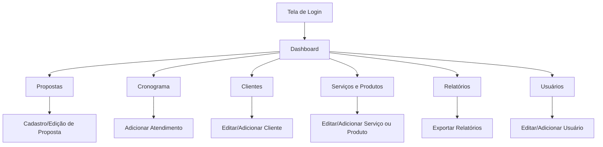

# Projeto de Interface - TecSolutions

## Visão Geral

Documentação das telas e fluxos de interface do sistema **TecSolutions**, uma plataforma para gerenciamento de propostas comerciais, cronogramas de atendimento, clientes, serviços, produtos e relatórios.

---

## Telas do Site e Sistema

### 1. Tela Home (Site Institucional)

**Descrição:**

- Página inicial com informações da empresa  
- Links para "Sobre", "Serviços" e "Contato"  
- Botão de acesso ao sistema  

---
### 2. Tela Sobre (Site Institucional)

**Descrição:**

- Página com informações detalhadas sobre a empresa  
- Apresenta a missão, visão e valores  
- Destaque para a história e trajetória da empresa  
- Espaço para apresentar a equipe ou principais responsáveis   

---
### 3. Tela Serviços (Site Institucional)

**Descrição:**

- Página destinada à apresentação dos serviços oferecidos pela empresa  
- Destaque visual para cada serviço, com título e breve descrição  
- Possibilidade de incluir imagens ou ícones ilustrativos  
- Seção com chamada para ação (ex: solicitar orçamento, entrar em contato)  

---
### 4. Tela Contato (Site Institucional)

**Descrição:**

- Página dedicada ao contato direto com a empresa  
- Formulário para envio de mensagens (nome, e-mail, telefone e mensagem)  
- Informações de contato como telefone, e-mail e endereço  
- Links para redes sociais e canais de atendimento  
- Possibilidade de integração com mapa (Google Maps) para localização  

---

### 5. Tela Login

**Descrição:**

- Página de autenticação do sistema  
- Campos para usuário (e-mail/CPF) e senha  
- Opção de "Esqueci minha senha"  
- Botão de login com validação  

---

### 6. Tela Dashboard

**Descrição:**

- Painel inicial do sistema após login  
- Resumo de atividades e indicadores principais  
- Cards com acesso rápido para módulos do sistema  
- Visual moderno com estatísticas e atalhos  

---

### 7. Tela Proposta

**Descrição:**

- Listagem de propostas comerciais já criadas  
- Filtros por cliente, status e período  
- Ações rápidas: visualizar, editar, excluir  
- Botão para criar nova proposta  

---

### 8. Tela Nova Proposta

**Descrição:**

- Formulário para criar propostas comerciais  
- Campos para cliente, serviços e valores  
- Cálculo automático de totais  
- Botão de salvar e gerar documento em PDF  

---

### 9. Tela Clientes

**Descrição:**

- Listagem de clientes cadastrados no sistema  
- Busca e filtros por nome, CNPJ ou contrato  
- Ações: visualizar, editar, excluir  
- Botão para adicionar novo cliente  

---

### 10. Tela Inventário de Hardware

**Descrição:**

- Listagem de equipamentos cadastrados (PCs, notebooks, impressoras, etc.)  
- Colunas com modelo, número de série, status e localização  
- Opções de filtro e busca por tipo de equipamento  
- Botão para adicionar novo hardware  

---

### 11. Tela Formulário Hardware

**Descrição:**

- Formulário para cadastro ou edição de equipamentos  
- Campos para marca, modelo, número de série e status  
- Seleção de cliente ou setor vinculado  
- Botão de salvar alterações  

---

### 12. Tela Inventário de Software

**Descrição:**

- Listagem de softwares licenciados e instalados  
- Informações de chave de licença, versão e validade  
- Busca por nome do software ou cliente  
- Botão para adicionar novo software  

---

### 13. Tela Formulário Software

**Descrição:**

- Formulário de cadastro/edição de softwares  
- Campos para nome, versão, licença e validade  
- Associação do software ao cliente  
- Botão para salvar informações  

---

### 14. Tela Atendimento

**Descrição:**

- Listagem de atendimentos em andamento ou finalizados  
- Filtros por cliente, tipo de atendimento e status  
- Ações: visualizar, editar, encerrar  
- Botão para abrir novo atendimento  

---

### 15. Tela Atendimento Remoto

**Descrição:**

- Registro de atendimentos realizados remotamente  
- Campos para cliente, descrição e tempo gasto  
- Upload de arquivos ou capturas de tela  
- Botão para finalizar atendimento  

---

### 16. Tela Atendimento Presencial

**Descrição:**

- Registro de atendimentos presenciais no cliente  
- Campos para horas técnicas, materiais utilizados e observações  
- Associação do atendimento ao contrato ou chamado aberto  
- Botão para salvar atendimento  

---

### 17. Tela Serviços de Laboratório

**Descrição:**

- Registro de serviços realizados em laboratório interno  
- Listagem de equipamentos em manutenção  
- Status de cada serviço (em análise, em reparo, concluído)  
- Botão para adicionar novo serviço  

---

### 18. Tela Serviços Terceiros

**Descrição:**

- Registro de serviços executados por parceiros ou fornecedores  
- Campos para empresa prestadora, tipo de serviço e status  
- Controle de custos associados  
- Botão para adicionar novo registro  

---

### 19. Tela Serviços

**Descrição:**

- Listagem geral de serviços cadastrados  
- Filtros por cliente, tipo e status  
- Ações de edição e exclusão  
- Botão para criar novo serviço  

---

### 20. Tela Formulário Serviços

**Descrição:**

- Formulário para cadastro/edição de serviços  
- Campos para título, descrição, valor e cliente associado  
- Seleção do tipo de serviço (remoto, presencial, laboratório, terceiros)  
- Botão para salvar  

---

### 21. Tela Produtos

**Descrição:**

- Listagem de produtos comercializados pela empresa  
- Colunas com nome, categoria, preço e estoque  
- Ações de visualizar, editar, excluir  
- Botão para adicionar novo produto  

---

### 22. Tela Formulário Produtos

**Descrição:**

- Formulário para cadastro/edição de produtos  
- Campos para nome, categoria, preço e estoque  
- Associação do produto a propostas e clientes  
- Botão de salvar informações  

---

### 23. Tela Relatórios

**Descrição:**

- Listagem de relatórios gerados pelo sistema  
- Filtros por cliente, tipo e período  
- Opções para visualizar, exportar ou excluir  
- Botão para gerar novo relatório  

---

### 24. Tela Gerar Relatório

**Descrição:**

- Formulário para geração de relatórios personalizados  
- Seleção de cliente, período e tipo de relatório  
- Opção de exportação em PDF ou Excel  
- Botão para gerar relatório  

---

### 25. Tela Usuários

**Descrição:**

- Listagem de usuários cadastrados no sistema  
- Informações de nome, e-mail, cargo e permissões  
- Ações: editar, redefinir senha, excluir  
- Botão para adicionar novo usuário  

---

### 26. Tela Formulário Usuários

**Descrição:**

- Formulário para cadastro/edição de usuários  
- Campos para nome, e-mail, senha e perfil de acesso  
- Definição de permissões (admin/técnico)  
- Botão de salvar alterações  

---

## Fluxo de Navegação

