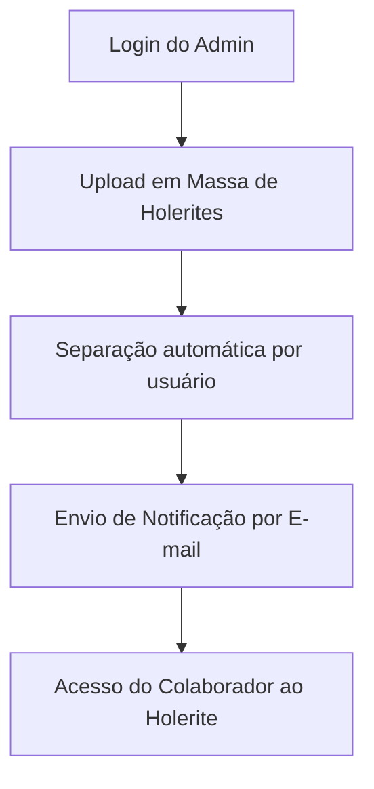

# 📄 eHolerite – Sistema de Gestão de Holerites Online

> **Transformando processos com tecnologia e segurança.**

---

## 🎥 Demonstração em Vídeo

> Assista à apresentação do sistema eHolerite:

[Clique aqui para assistir ao vídeo da apresentação](./Apresentacao_eHolerite.mp4)

---

## 📄 Download da Apresentação em PDF

Você pode visualizar ou baixar a versão em PDF da apresentação:

🔗 [Clique aqui para baixar a apresentação em PDF](./Apresentacao_eHolerite.pdf)

---

## 📌 Introdução

O **eHolerite** é um sistema web que permite que empresas organizem e disponibilizem holerites e comunicados de forma digital, segura e automatizada. A solução busca otimizar processos do RH e garantir agilidade na entrega de documentos corporativos.

---

## ❗ Problemas Enfrentados

- Envio manual de holerites é demorado e inseguro
- Risco de perda de documentos físicos
- Baixa rastreabilidade de entregas
- RH sobrecarregado com tarefas repetitivas

---

## ✅ Solução: eHolerite

- Upload em massa de holerites em PDF
- Distribuição automática por usuário
- Acesso seguro via login com autenticação
- Consulta por mês/ano
- Notificações por e-mail

---

## 🔧 Principais Funcionalidades

- 👤 Cadastro de usuários (com perfis de admin e colaborador)
- 📤 Upload automático e inteligente de documentos
- 🔍 Filtros por data e tipo de documento
- 📬 Envio automático de notificações por e-mail
- ☁️ Armazenamento em nuvem (AWS S3)

---

## 🛠 Tecnologias Utilizadas

| Camada         | Tecnologias               |
| -------------- | ------------------------- |
| Frontend       | React, Tailwind CSS, Vite |
| Backend        | Node.js, Express          |
| Banco de Dados | MongoDB                   |
| Armazenamento  | AWS S3                    |
| Notificações   | Nodemailer                |
| Deploy         | Render                    |

---

## 🎯 Público-Alvo

- Pequenas e médias empresas
- Departamentos de RH
- Escritórios de contabilidade
- Organizações que lidam com documentos mensais recorrentes

---

## 🚀 Benefícios

- Redução de tempo com tarefas operacionais
- Acesso seguro aos documentos
- Eliminação de impressão em papel
- Histórico acessível e organizado
- Rastreabilidade de acessos e downloads

---

## 🔁 Fluxo de Funcionamento

